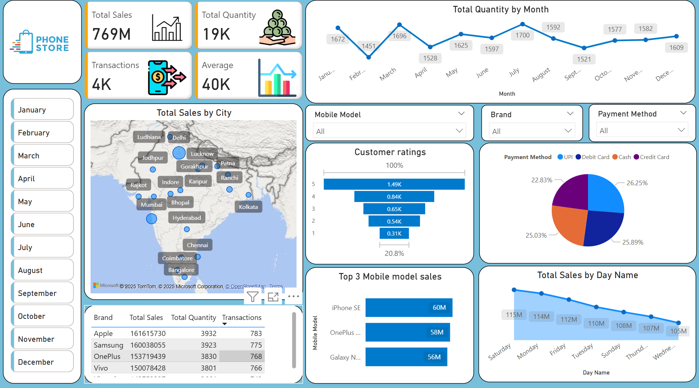

# 📊 Mobile Sales Data Dashboard – Power BI

🚀 This is my first interactive Power BI dashboard project that visualizes mobile sales data across India.

## 🔧 Key Features:
- Total sales, quantity, transactions, and average sales value
- Dynamic map visuals for city-wise insights
- Brand-wise and model-wise breakdown
- Monthly and weekday trends
- Customer rating funnel and payment method analysis
- Interactive filters for deep-dive analysis

📷 Dashboard Preview:

🎯 **Goal:** To transform raw mobile sales data into a visually appealing, business-friendly dashboard for better decision-making.

📎 **Project File:** [`mobile-store-dashboard.pbix`](mobile-store-dashboard.pbix)
